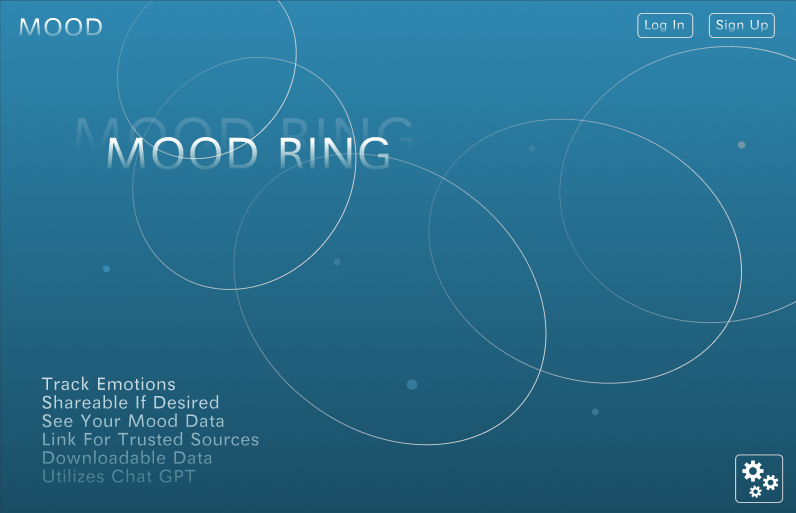
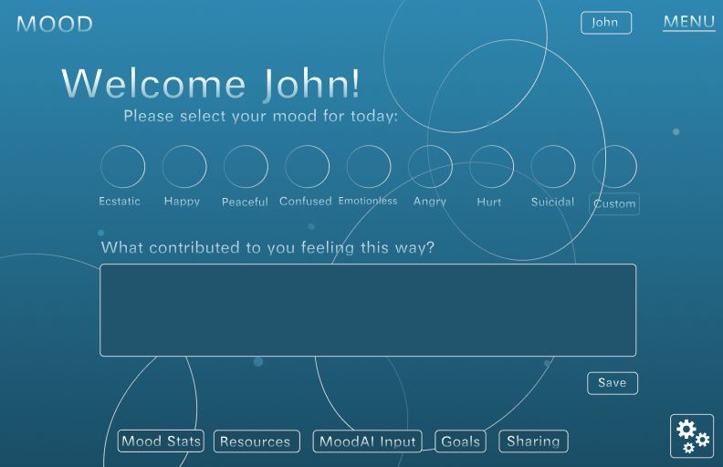

# Mood Mental Health Helper

## &#128073;&#127996; [View Deployed Site Here](https://mood-mental-health.vercel.app/) &#128072;&#127996;

## Purpose &#128680;

### The idea behind this project is to:

- Help people track their emotions and mental health over time
- Get brief AI generated feedback to point them in the right direction
- Focus on pointing those in need to other people, rather than their devices
- To increase mindfulness & awareness of what may be impacting mental health

### Why did I want to develop a Mood Mental Health Helper?

- I’ve personally experienced mental health struggles to a small degree, and I’ve witnessed some close to me deal with them to a large degree.
- It can be helpful to track how you’re doing regularly, as well as stopping to take inventory of why you’re feeling that way.
- Those kinds of statistics would be helpful to share with a mental health professional.
- The addition of responses from Chat GPT would give some quickly accessible, unbiased source and responder to their initial responses. The goal would be to have ChatGPT to point users to real life people in the everyday, but especially if they’re struggling greatly with their mental health.

### Why is this project worth my final project?

- My personal connection to the cause of helping those with mental health struggles. This will help me be more passionate and motivated on the project to get it done.
- The use of AI in a project will give me great experience, not only in using APIs in general, but helping me learn the workings of AI in applying to projects. This understanding is crucial as AI becomes the “calculator” of our time. It will soon be just as widely used, if it’s not already, so it’s important for me to understand that technology and utilize it.
- If others were to use this site/app it would have a great social impact on those in need.
- It appears there are mood trackers out there, but a lot of them have horrible UI and are not very user friendly.

## User Stores &#128187;

### Current

As a user I can ...

- Set my daily mood by selecting from:
  - a range of predefined options OR
  - entering a custom mood AND
  - be stopped if I hit submit, but hadn't selected a mood yet
- Provide a brief description of the events or factors influencing my current mood.
- View insights generated by ChatGPT based on my mood entries and mood reason description.
- Access HTTP Enpoints for the Mood API:
  - Mood Selection Options:
    - GET Mood options
    - POST Mood options
    - PUT Mood options (update)
    - DELETE Mood options
- Access emoji code & name of mood attached to the emoji within the Mood Options Array
- Copy the advice given from ChatGPT with the press of a button
- In the footer, view the Mood Site creator links:
  - https://savcode.co website
  - sav@savcode.co email
  - savannahcode Github
  - savcode.co Instagram
- Click on the Menu Button to open a drawer with links to:
  - Mental Health Resources page
  - Home page

### Future (to be added)

As a user, I can ...

- Access HTTP Enpoints for the Mood API:
  - Chat GPT OpenAI prompt
    - GET OpneAI prompt
    - POST OpneAI prompt
    - PUT OpneAI prompt (update)
    - DELETE OpneAI prompt
- Create an account with a unique username and password.
- Log in to the app using my credentials.
- View a weekly or monthly summary of my mood statistics, including average mood and mood fluctuations.
- Receive a text reminder at midday prompting me to open the app and log my mood.
- Export my mood data and chat interactions to share with my mental health professional.
- Customize notification settings, including the frequency and timing of reminders.
- Set personal goals related to my mental well-being, and the app will provide periodic updates on my progress.
- Receive recommendations from ChatGPT on activities or exercises to improve my mood.
- Access a resource section providing information on mental health and well-being.
- Invite friends or family members to connect on the app, allowing them to view my mood trends and provide support.
- Receive gentle encouragement from ChatGPT to reach out to a trusted friend, family member, or mental health professional if my mood suggests a need for support.

Future MOOD Mockups:

